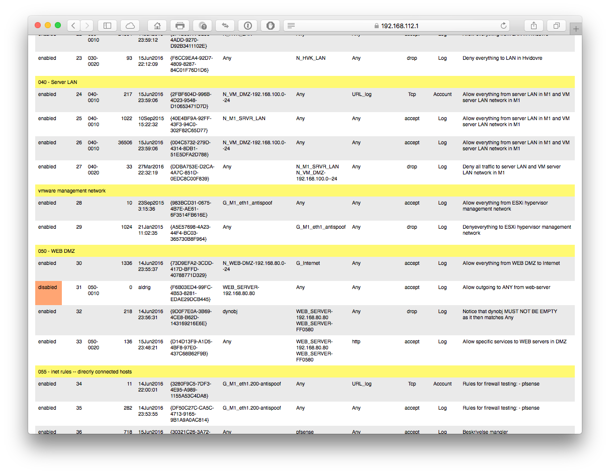

# Detecting Dead Rules in Check Point firewall rule bases

**i2drd** is a simple system aiming to detect unused rules in a Check Point
firewall rule base. This version is compatible with GAiA and has been tested on
R77.10, R77.20 and R77.30, and should work with all later R77.x versions. It may
work with other versions: the rule base format and the log file format is detected
and the required information available from R65 and onwards, but the web server 
configuration requires R77.

**UNIfw1lr** is free software and released under a
[modified BSD License](https://opensource.org/licenses/BSD-3-Clause), see LICENSE. Using the
software requires a valid support contract with [Check Point Technologies](http://www.checkpoint.com).

**i2drd** is installed as an [rpm package](http://en.wikipedia.org/wiki/RPM_Package_Manager) and
the installation and configuration is described in ``INSTALL.md``.

The system consist of the following components:

  - A Web-server: the system uses the [apache web server](https://en.wikipedia.org/wiki/Apache_HTTP_Server)
    supplied and maintained by Check Point, as part of the base operating system
  - A collection of applications for parsing the _rule base_, extracting information from the _exported logfile_ etc.

Access to the web-server is controlled by the firewall. The server runs on **TCP
port 8088**. This may be changed in ``/var/opt/i2drd/etc/drd`` but is not
recommended.

Log files are exported on a daily basis at midnight as configured in **UNIfw1lr**.

Processing the rule base and log file in order to detect unused rules starts at 13:59. This may change in the future.

All rules has a unique _UUID_ which is logged. **i2drd** reads the log file and the rule base and counts the number
of hits for each UUID. The result is written to a database and includes the last time a rule had a hit.

The date and time of the first time **i2drd** runs is recorded.

# House keeping

   - Inactive rules are not used actively in the rule base and are marked with <html>this color(orange)</html>.
     They may be deleted unless they serve any other purpose (e.g. documentation).
   - Rules with no hits since _first run_ are marked with <html>this color(pink)</html>.
     If _logging is disabled on the rule_ then consider deleting the rule: it does not serve any firewall purpose.
   - Rules without hits today are marked with <html>this color (pale yellow)</html> and should be checked firmly.
     The date the rule was last used and the number of days since then is in the report.

<html>
 &nbsp;
</html>
An example is shown here:

## Limitations

The scope of the application are _rules_, not the _individual sources_, _destinations_ and
_services_ which makes up a rule.

Assume there is 100 hits on the rule below, which has 3 sources, 2 destinations
and two services.

<html>
<table>
	<thead>
		<tr>
			<th>
				Nr.</th>
			<th>
				Source</th>
			<th>
				Destignation</th>
			<th>
				Service</th>
		</tr>
	</thead>
	<tbody>
		<tr>
			<td>
				1</td>
			<td>
				internal_mail_1 
				internal_mail_2 
				monitor_host_1</td>
			<td>
				external_mail_1 
				external_mail_2</td>
			<td>
				SMTP 
				ICMP</td>
		</tr>
	</tbody>
</table>
</html>

As we only know the hit count it is only possible to conclude that the rule is in use.
It is however _not possible_ to determine which network and service objects is used.

It may be that ``monitor_host_1`` is monitoring ``external_mail_2`` with ``ICMP Echo Request``
while no mail is processed.

The same goes for _group objects_, _ranges_ and _networks_: one single host may be responsible
for all traffic.

Proceed with care.

<html>
 &nbsp;
</html>
### Notice
The package **i2drd** will be merged with **UNIfw1lr** (UNI•C firewall-1 log rotation) in
the not so near future (don't hold your breath).

It is important to write documentation and guidelines as an integrated part of the software
development process. So this documentation is made using common software tools
and organised as text files written in [vi](https://en.wikipedia.org/wiki/Vi),
saved as github flavored [markdown](https://en.wikipedia.org/wiki/Markdown),
controlled by a [makefile](https://en.wikipedia.org/wiki/Make_(software) and
converted do [html](www.w3schools.com/html/html_intro.asp) and
[pdf](https://en.wikipedia.org/wiki/Portable_Document_Format) with
[discount](www.pell.portland.or.us/~orc/Code/discount) and
[wkhtmltopdf](http://wkhtmltopdf.org). Everything kept and controlled in
[git](https://www.atlassian.com/git/tutorials/what-is-git).

The silly front page is made with a Mac application, saved as pdf and processed
with ``pdfunite``. Just for fun, and finished [in shorter time than going
shopping in Fakta](https://en.wikipedia.org/wiki/Fakta).

